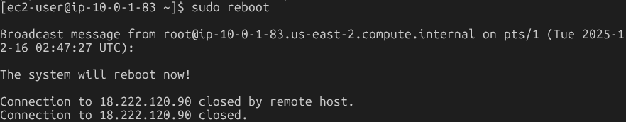
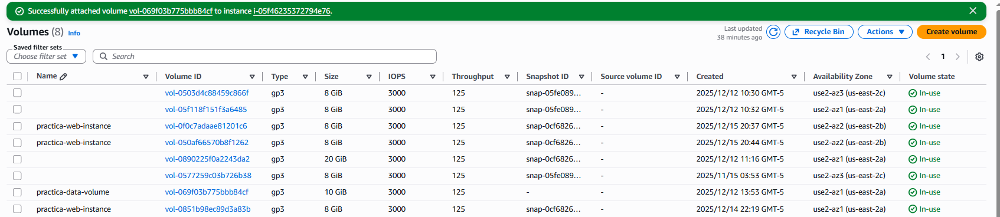
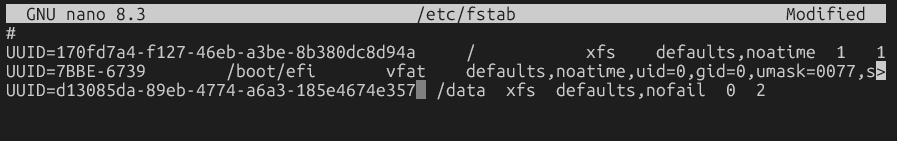

# Práctica: Gestión de Volúmenes EBS en EC2


## Objetivo
Aprender a gestionar volúmenes de almacenamiento EBS (Elastic Block Store) en instancias EC2, incluyendo la ampliación del volumen raíz y la creación y adjunción de nuevos volúmenes.

## Arquitectura
- **Instancia EC2 existente** de la práctica anterior
- **Volumen raíz EBS** (8 GiB) que ampliaremos a 20 GiB
- **Nuevo volumen EBS** (10 GiB) que crearemos y adjuntaremos


## PARTE 1: Ampliar el Volumen Raíz Existente

### FASE 1: Identificación de Volumen Actual

#### Paso 1.1: Conectarse a la instancia

Conéctate a tu instancia EC2 por SSH:

```bash
ssh -i practica-ssh-key.pem ec2-user@<IP-PUBLICA>
```

#### Paso 1.2: Verificar el tamaño actual del sistema de archivos

Una vez conectado, ejecuta:

```bash
# Ver el espacio en disco disponible
df -h

# Ver información de los dispositivos de bloques
lsblk

# Ver el tamaño del volumen raíz
sudo fdisk -l /dev/xvda
```

**Ejemplo de output esperado:**

```
[ec2-user@ip-10-0-1-45 ~]$ df -h
Filesystem      Size  Used Avail Use% Mounted on
devtmpfs        4.0M     0  4.0M   0% /dev
tmpfs           475M     0  475M   0% /dev/shm
tmpfs           190M  2.9M  188M   2% /run
/dev/xvda1      8.0G  1.5G  6.5G  19% /
tmpfs           475M     0  475M   0% /tmp

[ec2-user@ip-10-0-1-45 ~]$ lsblk
NAME    MAJ:MIN RM SIZE RO TYPE MOUNTPOINT
xvda    202:0    0   8G  0 disk 
└─xvda1 202:1    0   8G  0 part /
```

**Observación:**
- El volumen `/dev/xvda` tiene 8 GiB
- La partición `/dev/xvda1` está montada en `/` (raíz)
- El sistema de archivos muestra 8.0G disponible

#### Paso 1.3: Anotar el Volume ID desde la consola

1. Ve a la consola de **EC2**: https://console.aws.amazon.com/ec2/
2. En el panel izquierdo, haz clic en **Instances**
3. Selecciona tu instancia `practica-ec2-ssh`
4. Ve a la pestaña **Storage**
5. Verás el volumen raíz (normalmente `/dev/xvda` o `/dev/sda1`)
6. Haz clic en el **Volume ID** (ej: `vol-0123456789abcdef0`)
7. **Anota este Volume ID**

---

### FASE 2: Ampliar el Volumen desde la Consola

#### Paso 2.1: Modificar el tamaño del volumen

1. En la página del volumen (o ve a **EC2 > Volumes**)
2. Selecciona el volumen raíz de tu instancia
3. Haz clic en **Actions > Modify volume**
4. En **Size (GiB)**, cambia de `8` a `20`
5. Haz clic en **Modify**
6. En el diálogo de confirmación, revisa los cambios y haz clic en **Modify**
7. Verás el mensaje: "Successfully modified volume"
8. El estado del volumen cambiará a `Modifying` → `Optimizing` (2-5 minutos)

**⚠️ Importante:**
- La modificación del volumen se puede hacer **sin detener la instancia**
- No hay pérdida de datos durante el proceso
- El volumen físico se amplía, pero el sistema de archivos aún no lo sabe

#### Paso 2.2: Verificar el progreso de la modificación

1. En **EC2 > Volumes**, selecciona tu volumen
2. Ve a la pestaña **Storage** o refresca la página
3. Espera a que el estado de la modificación sea `Completed` o `Optimizing`
4. El tamaño debe mostrar `20 GiB`

---

### FASE 3: Extender el Sistema de Archivos

#### Paso 3.1: Verificar que el kernel ve el nuevo tamaño

Vuelve a tu sesión SSH y ejecuta:

```bash
# Ver el tamaño del volumen
lsblk
```

**Output esperado:**

```
NAME    MAJ:MIN RM SIZE RO TYPE MOUNTPOINT
xvda    202:0    0  20G  0 disk           <- ¡Ahora muestra 20G!
└─xvda1 202:1    0   8G  0 part /         <- Pero la partición sigue en 8G
```

**Observa:**
- El dispositivo `/dev/xvda` ahora muestra 20G
- Pero la partición `/dev/xvda1` sigue mostrando 8G
- El sistema de archivos aún no ha crecido

#### Paso 3.2: Verificar el sistema de archivos actual

```bash
# Ver el tipo de sistema de archivos
df -Th

# Ver información detallada de la partición
sudo file -s /dev/xvda1
```

**Para Amazon Linux 2023, el sistema de archivos es XFS.**

#### Paso 3.3: Extender la partición (si es necesario)

Amazon Linux 2023 utiliza una partición que ocupa todo el disco, pero necesitamos extenderla:

```bash
# Instalar growpart (debería estar instalado por defecto)
sudo yum install -y cloud-utils-growpart

# Verificar el estado actual
sudo lsblk

# Extender la partición 1 del disco xvda
sudo growpart /dev/xvda 1
```

**Output esperado:**

```
CHANGED: partition=1 start=2048 old: size=16775168 end=16777216 new: size=41940959 end=41943007
```

#### Paso 3.4: Verificar que la partición creció

```bash
lsblk
```

**Output esperado:**

```
NAME    MAJ:MIN RM SIZE RO TYPE MOUNTPOINT
xvda    202:0    0  20G  0 disk 
└─xvda1 202:1    0  20G  0 part /         <- ¡Ahora la partición es de 20G!
```

#### Paso 3.5: Extender el sistema de archivos XFS

```bash
# Extender el sistema de archivos XFS para usar todo el espacio
sudo xfs_growfs -d /

# Nota: Si usaras ext4, el comando sería:
# sudo resize2fs /dev/xvda1
```

**Output esperado:**

```
meta-data=/dev/xvda1             isize=512    agcount=4, agsize=524224 blks
         =                       sectsz=512   attr=2, projid32bit=1
         =                       crc=1        finobt=1, sparse=1, rmapbt=0
         =                       reflink=1
data     =                       bsize=4096   blocks=2096896, imaxpct=25
         =                       sunit=0      swidth=0 blks
naming   =version 2              bsize=4096   ascii-ci=0, ftype=1
log      =internal log           bsize=4096   blocks=2560, version=2
         =                       sectsz=512   sunit=0 blks, lazy-count=1
realtime =none                   extsz=4096   blocks=0, rtextents=0
data blocks changed from 2096896 to 5242619
```

#### Paso 3.6: Verificar el nuevo tamaño

```bash
# Ver el espacio disponible
df -h
```

**Output esperado:**

```
Filesystem      Size  Used Avail Use% Mounted on
devtmpfs        4.0M     0  4.0M   0% /dev
tmpfs           475M     0  475M   0% /dev/shm
tmpfs           190M  2.9M  188M   2% /run
/dev/xvda1       20G  1.5G   19G   8% /         <- ¡Ahora muestra 20G!
tmpfs           475M     0  475M   0% /tmp
```

**¡Éxito! El sistema de archivos ahora usa los 20 GiB completos.**

---

## PARTE 2: Crear y Adjuntar un Nuevo Volumen EBS

### FASE 4: Crear un Nuevo Volumen EBS

#### Paso 4.1: Crear el volumen desde la consola

1. Ve a **EC2 > Volumes** en la consola de AWS
2. Haz clic en **Create volume**
3. Configura:
   - **Volume Type**: General Purpose SSD (gp3)
   - **Size (GiB)**: `10`
   - **Availability Zone**: **Importante:** Selecciona la **misma AZ** que tu instancia EC2
     - Puedes verla en **EC2 > Instances** → columna "Availability Zone"
     - Ej: `us-east-1a`
   - **Snapshot ID**: Déjalo vacío (no restore from snapshot)
   - **Encryption**: No seleccionar (o seleccionar si quieres cifrado)
   - **Tags**: 
     - Key: `Name`, Value: `practica-data-volume`
4. Haz clic en **Create volume**
5. Verás el mensaje: "Successfully created volume"
6. **Anota el Volume ID** (ej: `vol-0987654321fedcba0`)

**⚠️ Crítico:** El volumen y la instancia deben estar en la **misma Availability Zone**.




#### Paso 4.2: Esperar a que el volumen esté disponible

1. En la lista de volúmenes, busca tu nuevo volumen
2. Espera a que el **State** cambie de `Creating` a `Available` (10-30 segundos)

---

### FASE 5: Adjuntar el Volumen a la Instancia

#### Paso 5.1: Adjuntar el volumen

1. En **EC2 > Volumes**, selecciona el volumen `practica-data-volume`
2. Haz clic en **Actions > Attach volume**
3. Configura:
   - **Instance**: Selecciona tu instancia `practica-ec2-ssh`
   - **Device name**: AWS sugiere un nombre como `/dev/sdf`
     - **Nota:** En Amazon Linux 2023, este dispositivo aparecerá como `/dev/nvme1n1` o `/dev/xvdf`
     - No te preocupes, lo identificaremos después
4. Haz clic en **Attach volume**
5. El estado cambiará de `Available` a `In-use`

**¿Qué es el device name?**
- Es el nombre del dispositivo de bloques que el sistema operativo usará para acceder al volumen
- En instancias modernas con NVMe, el nombre puede diferir del especificado
**
**Resultado**:


---

### FASE 6: Configurar el Nuevo Volumen en el Sistema Operativo

#### Paso 6.1: Identificar el nuevo dispositivo

Vuelve a tu sesión SSH (o conéctate de nuevo):

```bash
# Listar todos los dispositivos de bloques
lsblk

# Ver dispositivos de bloques con más detalle
lsblk -f

# Ver todos los dispositivos NVMe (en instancias modernas)
ls -l /dev/nvme*

# Ver dispositivos tradicionales
ls -l /dev/xvd*
```

**Output esperado (instancias con NVMe):**

```
[ec2-user@ip-10-0-1-45 ~]$ lsblk
NAME        MAJ:MIN RM SIZE RO TYPE MOUNTPOINT
nvme0n1     259:0    0  20G  0 disk 
└─nvme0n1p1 259:1    0  20G  0 part /
nvme1n1     259:2    0  10G  0 disk           <- ¡El nuevo volumen!
```

**O en instancias tradicionales:**

```
[ec2-user@ip-10-0-1-45 ~]$ lsblk
NAME    MAJ:MIN RM SIZE RO TYPE MOUNTPOINT
xvda    202:0    0  20G  0 disk 
└─xvda1 202:1    0  20G  0 part /
xvdf    202:80   0  10G  0 disk               <- ¡El nuevo volumen!
```

**Identifica el nuevo dispositivo:**
- Es el que tiene 10G
- NO tiene punto de montaje (MOUNTPOINT vacío)
- En este ejemplo, usaremos `/dev/nvme1n1` (ajusta según tu sistema)

**Resultado:** Salida por consola
```[ec2-user@ip-10-0-1-83 ~]$ lsblk
NAME          MAJ:MIN RM SIZE RO TYPE MOUNTPOINTS
nvme0n1       259:0    0  20G  0 disk
├─nvme0n1p1   259:1    0  20G  0 part /
├─nvme0n1p127 259:2    0   1M  0 part
└─nvme0n1p128 259:3    0  10M  0 part /boot/efi
nvme1n1       259:4    0  10G  0 disk
```


#### Paso 6.2: Verificar que el dispositivo está vacío

```bash
sudo file -s /dev/nvme1n1
```

**Output esperado para un volumen nuevo:**

```
/dev/nvme1n1: data
```

Si dice `data`, el volumen está vacío. Si muestra un sistema de archivos, significa que ya tiene datos.

**Resultado:** Salida por consola
```[ec2-user@ip-10-0-1-83 ~]$ sudo file -s /dev/nvme1n1
/dev/nvme1n1: data
```


#### Paso 6.3: Crear un sistema de archivos en el nuevo volumen

```bash
# Crear un sistema de archivos XFS
sudo mkfs -t xfs /dev/nvme1n1

# Alternativa: crear ext4 si lo prefieres
# sudo mkfs -t ext4 /dev/nvme1n1
```

**Output esperado:**

```
meta-data=/dev/nvme1n1           isize=512    agcount=4, agsize=655360 blks
         =                       sectsz=512   attr=2, projid32bit=1
         =                       crc=1        finobt=1, sparse=1, rmapbt=0
         =                       reflink=1
data     =                       bsize=4096   blocks=2621440, imaxpct=25
         =                       sunit=0      swidth=0 blks
naming   =version 2              bsize=4096   ascii-ci=0, ftype=1
log      =internal log           bsize=4096   blocks=2560, version=2
         =                       sectsz=512   sunit=0 blks, lazy-count=1
realtime =none                   extsz=4096   blocks=0, rtextents=0
```

**⚠️ Advertencia:** Este comando **eliminará todos los datos** en el dispositivo. Solo úsalo en volúmenes nuevos o que quieras formatear.

#### Paso 6.4: Crear un punto de montaje

```bash
# Crear un directorio donde montaremos el volumen
sudo mkdir -p /data

# Verificar que se creó
ls -ld /data
```

**Resultado objetivo:**

```drwxr-xr-x. 2 root root 6 Dec 16 02:26 /data ```

#### Paso 6.5: Montar el volumen

```bash
# Montar el volumen en /data
sudo mount /dev/nvme1n1 /data

# Verificar que se montó correctamente
df -h
```

**Output esperado:**

```
Filesystem      Size  Used Avail Use% Mounted on
devtmpfs        4.0M     0  4.0M   0% /dev
tmpfs           475M     0  475M   0% /dev/shm
tmpfs           190M  2.9M  188M   2% /run
/dev/nvme0n1p1   20G  1.5G   19G   8% /
tmpfs           475M     0  475M   0% /tmp
/dev/nvme1n1     10G  104M  9.9G   2% /data       <- ¡El nuevo volumen montado!
```

**Output obtenido por consola**
```[ec2-user@ip-10-0-1-83 ~]$ df -h
Filesystem        Size  Used Avail Use% Mounted on
devtmpfs          4.0M     0  4.0M   0% /dev
tmpfs             459M     0  459M   0% /dev/shm
tmpfs             184M  436K  183M   1% /run
/dev/nvme0n1p1     20G  1.7G   19G   9% /
tmpfs             459M     0  459M   0% /tmp
/dev/nvme0n1p128   10M  1.3M  8.7M  13% /boot/efi
tmpfs              92M     0   92M   0% /run/user/1000
/dev/nvme1n1       10G  104M  9.9G   2% /data
```


#### Paso 6.6: Cambiar permisos y propietario

```bash
# Dar permisos al usuario ec2-user
sudo chown ec2-user:ec2-user /data

# Verificar permisos
ls -ld /data
```

**Output esperado:**

```
drwxr-xr-x 2 ec2-user ec2-user 6 Oct 30 15:30 /data
```
**Resultado obtenido por consola:**
```
drwxr-xr-x. 2 ec2-user ec2-user 6 Dec 16 02:26 /data 
```


#### Paso 6.7: Probar el nuevo volumen

```bash
# Crear un archivo de prueba
echo "Este es un archivo en el nuevo volumen EBS" > /data/test.txt

# Verificar
cat /data/test.txt

# Ver el espacio usado
df -h /data
```
**Output obtenido por consola**
```[ec2-user@ip-10-0-1-83 ~]$ df -h /data
Filesystem      Size  Used Avail Use% Mounted on
/dev/nvme1n1     10G  104M  9.9G   2% /data
```
---

### FASE 7: Configurar Montaje Automático (Persistente)

**⚠️ Importante:** Los pasos anteriores montan el volumen temporalmente. Si reinicias la instancia, el volumen no se montará automáticamente. Necesitamos configurar el montaje automático.

#### Paso 7.1: Obtener el UUID del volumen

```bash
# Listar los UUID de todos los dispositivos
sudo blkid

# O específicamente para nuestro dispositivo
sudo blkid /dev/nvme1n1
```

**Output esperado:**

```
/dev/nvme1n1: UUID="a1b2c3d4-e5f6-7890-abcd-ef1234567890" BLOCK_SIZE="512" TYPE="xfs"
```

**Output obtenido por consola**
```[ec2-user@ip-10-0-1-83 ~]$ sudo blkid /dev/nvme1n1
/dev/nvme1n1: UUID="d13085da-89eb-4774-a6a3-185e4674e357" BLOCK_SIZE="512" TYPE="xfs" 

```


**Anota el UUID** (ej: `a1b2c3d4-e5f6-7890-abcd-ef1234567890`)

**¿Por qué usar UUID en lugar del nombre del dispositivo?**
- Los nombres de dispositivo (`/dev/nvme1n1`, `/dev/xvdf`) pueden cambiar entre reinicios
- El UUID es único y permanente para ese volumen

#### Paso 7.2: Hacer una copia de seguridad de /etc/fstab

```bash
# IMPORTANTE: Siempre hacer backup antes de editar fstab
sudo cp /etc/fstab /etc/fstab.backup

# Verificar el backup
ls -l /etc/fstab*
```

#### Paso 7.3: Añadir entrada en /etc/fstab

```bash
# Editar el archivo fstab
sudo nano /etc/fstab

# O con vi
# sudo vi /etc/fstab
```

Añade esta línea al final del archivo (reemplaza el UUID con el tuyo):

```
UUID=a1b2c3d4-e5f6-7890-abcd-ef1234567890  /data  xfs  defaults,nofail  0  2
```




**Explicación de los campos:**
- `UUID=...`: Identificador único del volumen
- `/data`: Punto de montaje
- `xfs`: Tipo de sistema de archivos (usa `ext4` si creaste ext4)
- `defaults,nofail`: Opciones de montaje
  - `defaults`: Opciones estándar
  - `nofail`: No fallar el arranque si el volumen no está disponible
- `0`: No hacer dump (backup) del sistema de archivos
- `2`: Orden de verificación del sistema de archivos (0=no verificar, 1=raíz, 2=otros)


#### Paso 7.4: Probar la configuración de fstab

```bash
# Desmontar el volumen
sudo umount /data

# Verificar que se desmontó
df -h | grep data

# Probar el montaje con fstab
sudo mount -a

# Verificar que se montó correctamente
df -h | grep data
```

**Output esperado:**

```
/dev/nvme1n1     10G  104M  9.9G   2% /data
```

**Si hay un error:**
- Restaura el fstab original: `sudo cp /etc/fstab.backup /etc/fstab`
- Revisa la sintaxis de la línea añadida
- Verifica el UUID con `sudo blkid`


**Output obtenido por consola**
```
/dev/nvme1n1       10G  104M  9.9G   2% /data
```


#### Paso 7.5: Verificar que sobrevive a un reinicio (Opcional)

**⚠️ Esto reiniciará tu instancia:**

```bash
# Reiniciar la instancia
sudo reboot
```


```bash
ssh -i practica-ssh-key.pem ec2-user@<IP-PUBLICA>

# Verificar que el volumen se montó automáticamente
df -h | grep data

# Verificar que tus datos siguen ahí
cat /data/test.txt
```

**Output obtenido por consola**
```
S$ ssh -i practica-ssh-key.pem ec2-user@18.222.120.90
   ,     #_
   ~\_  ####_        Amazon Linux 2023
  ~~  \_#####\
  ~~     \###|
  ~~       \#/ ___   https://aws.amazon.com/linux/amazon-linux-2023
   ~~       V~' '->
    ~~~         /
      ~~._.   _/
         _/ _/
       _/m/'
Last login: Tue Dec 16 01:34:55 2025 from 181.237.79.187
[ec2-user@ip-10-0-1-83 ~]$ df -h | grep data
/dev/nvme1n1       10G  104M  9.9G   2% /data
[ec2-user@ip-10-0-1-83 ~]$ cat /data/test.txt
Este es un archivo en el nuevo volumen EBS
```
---